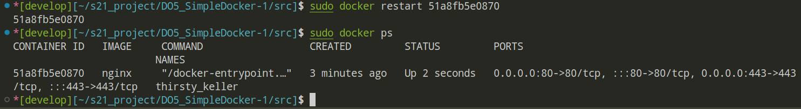
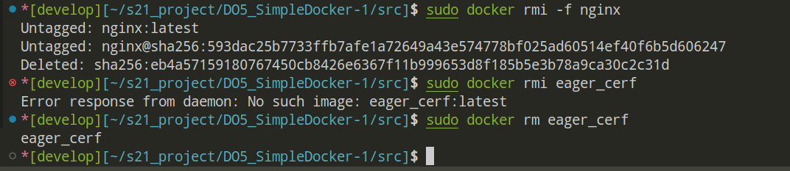

## Part 1. Готовый докер

* ### Взять официальный докер образ с **nginx** и выкачать его при помощи `docker pull`

* ### Проверить наличие докер образа через `docker images`

* ### Запустить докер образ через `docker run -d [image_id|repository]`
* ### Проверить, что образ запустился через `docker ps`

* ### Посмотреть информацию о контейнере через `docker inspect [container_id|container_name]`
  ### **Ip контейнера**

  ### **Размер контейнера**

  ### **Cписок замапленных портов**

* ### Остановить докер образ через `docker stop [container_id|container_name]`
  ### Проверить, что образ остановился через `docker ps`

* ### Запустить докер с портами 80 и 443 в контейнере, замапленными на такие же порты на локальной машине, через команду *run*

* ### Проверить, что в браузере по адресу *localhost:80* доступна стартовая страница **nginx**

* ### Перезапустить докер контейнер через `docker restart [container_id|container_name]`
  ### Проверить любым способом, что контейнер запустился

## Part 2. Операции с контейнером

* ### Прочитать конфигурационный файл *nginx.conf* внутри докер контейнера через команду *exec*

* ### Создать на локальной машине файл *nginx.conf*
  ### Настроить в нем по пути */status* отдачу страницы статуса сервера **nginx**
  ### Скопировать созданный файл *nginx.conf* внутрь докер образа через команду `docker cp`
  ### Перезапустить **nginx** внутри докер образа через команду *exec*
  ### Проверить, что по адресу *localhost:80/status* отдается страничка со статусом сервера **nginx**

* ### Экспортировать контейнер в файл *container.tar* через команду *export*
  ### Остановить контейнер

* ### Удалить образ через `docker rmi [image_id|repository]`, не удаляя перед этим контейнеры
  ### Удалить остановленный контейнер

* ### Импортировать контейнер обратно через команду *import*
  ### Запустить импортированный контейнер
  ### Проверить, что по адресу *localhost:80/status* отдается страничка со статусом сервера **nginx**

## Part 3. Мини веб-сервер

* ### Написать мини сервер на **C** и **FastCgi**, который будет возвращать простейшую страничку с надписью `Hello World!`

  

*  ### Запустить написанный мини сервер через *spawn-fcgi* на порту 8080

  
  
  
  
  
  
  
  
  
  
*  ### Написать свой *nginx.conf*, который будет проксировать все запросы с 81 порта на *127.0.0.1:8080*

  

*  ### Проверить, что в браузере по *localhost:81* отдается написанная вами страничка

  

*  ### Положить файл *nginx.conf* по пути *./nginx/nginx.conf* (это понадобится позже)

## Part 4. Свой докер

* ### Написать свой докер образ, который:
  ### 1) собирает исходники мини сервера на FastCgi из [Части 3](#part-3-мини-веб-сервер)
  ### 2) запускает его на 8080 порту
  ### 3) копирует внутрь образа написанный *./nginx/nginx.conf*
  ### 4) запускает **nginx**.